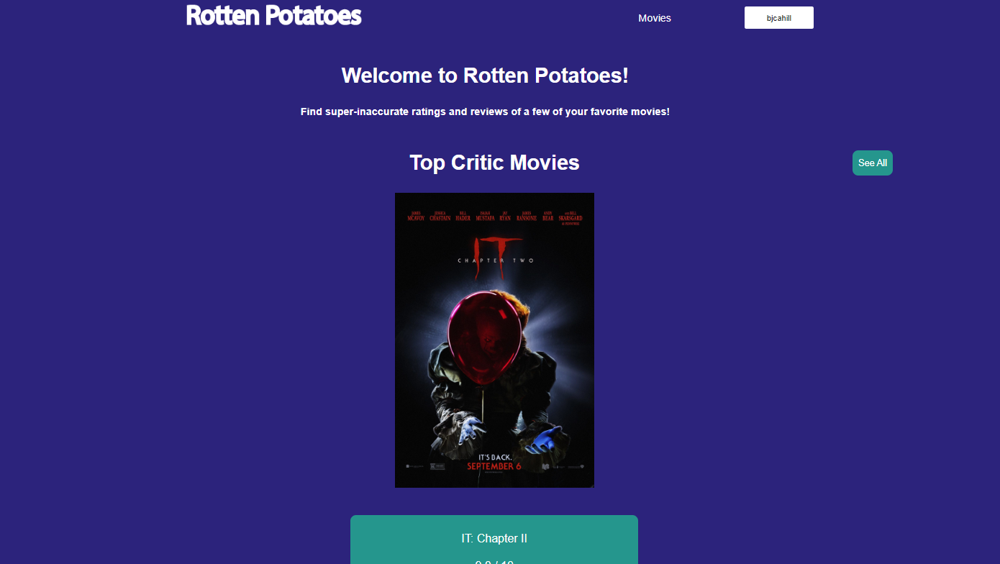
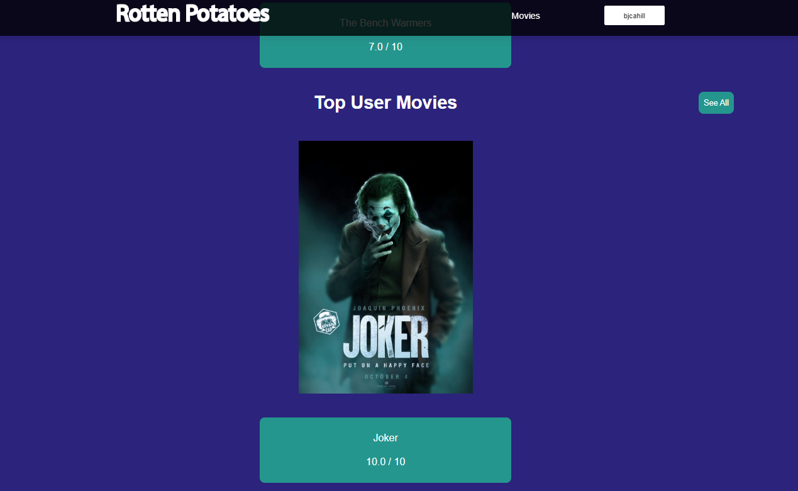
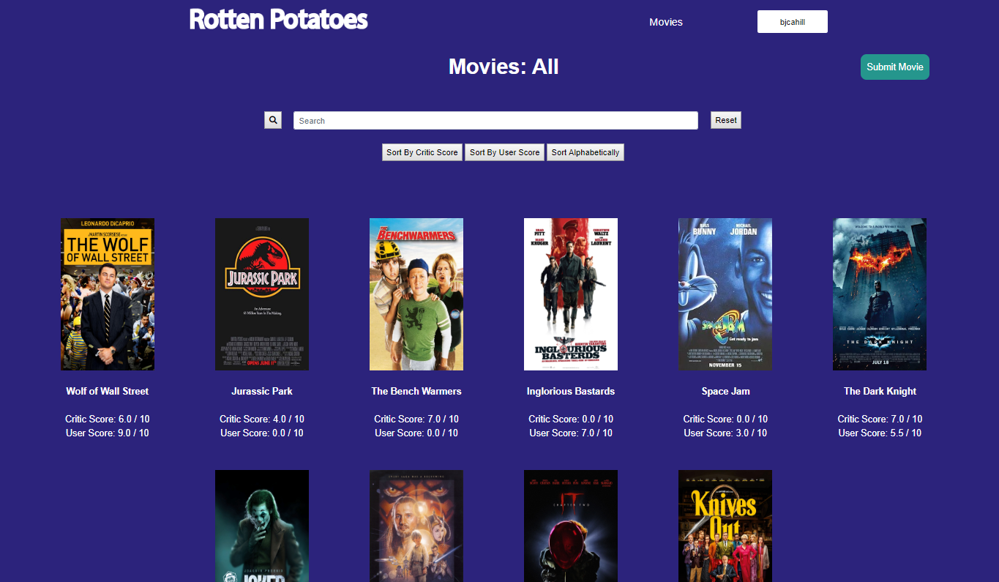

This is a project by Ben Cahill, Michael Ford, and Joshua Delgadillo created for CSC 307: Software Engineering.

The website is a movie reviewing website such as Rotten Tomatoes or IMDB. Both regular users and critics can create accounts and submit movie reviews.

## Homepage

## Movies Page

## User Profile

